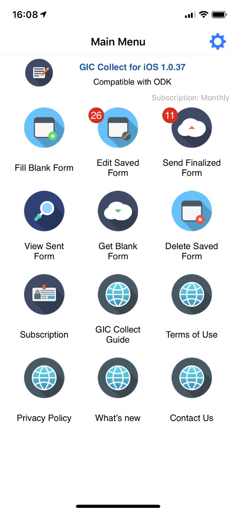

# Hola, XForms

XForms es un formato en XML, usado para la captura de datos en Web.

Con esta tenología es posible la creación, consumo y obtención de diversos tipos de contenido, tanto del aspecto personal, como del profesional. Todo esto a través de dispositivos moviles, como son los celulares y tabletas.

En este primer artículo, les quiero presentar una comparación práctica de los puntos principales para la creación de aplicaciones, tanto en Android como en iOS.

Este análisis esta acotado a un cierto tipo de aplicaciones que pueden ser desarrolladas con XForms y a un pequeño número de herramientas, que ciertamente no abarca el 100% de lo que en las otras plataformas puede hacerse, pero que es suficiente para ciertas necesidades y que sin lugar a dudas este abarca un rango muy amplio de necesidades.

## Plataforma Nativa

- Saber programar en Android y para iOS en Swift o en Objective-C, nivel alto de dificultad.
- Darte de alta en las tiendas de Google y Apple para publicar tus aplicaciones.
- De 4 a 8 meses para el desarrollo de las aplicaciones.
- De 2 a 4 semanas para la publicación de las aplicaciones.

## Plataformas Hibridas

- Saber programar C# para Xamarin, Javascript para Cordova y Sencha Ext JS, nivel medio alto de dificultad.
- Darte de alta en las tiendas de Google y Apple para publicar tus aplicaciones.
- De 4 a 8 meses para el desarrollo de las aplicaciones.
- De 2 a 4 semanas para la publicación de las aplicaciones.

## Plataforma XForms

- Saber Excel (ok y un lenguaje declarativo para XForms, nivel medio bajo de dificultad).
- No es necesario darte de alta en la tiendas de Google y Apple, ya existen [ODK Collect para Android en Google Play](https://play.google.com/store/apps/details?id=org.odk.collect.android&hl=en) y [GIC Collect para iOS en Apple Store](https://apps.apple.com/mx/app/gic-collect/id1485932698).
- De 1 semana a 1 mes para el desarrollo de las formas.
- No es necesario, la publicacion de las formas es inmediato.

## Un pequeño muestrario de lo que puede desarrollarse

- Automatización de oficinas. Formas que deben llenarse, Material de entrenamientos y Manules de operación, Procedimientos, Minutas, etc, etc.
- Educación. Libros normales y de Autoestudio, Examenes, Diversos materiales de apoyo, etc, etc.
- Encuestas. Desde muy sencillas hasta muy complejas, incluyendo Mapas, Codigos de Barras, Fotos, Audio y Video, etc, etc.
- Cualquier otro, solo requiere de creatividad.

Te invito a conocer las soluciones, para lo cual, si tienes Android instala [ODK Collect](https://play.google.com/store/apps/details?id=org.odk.collect.android&hl=en) y si tienes iPhone instala [GIC Collect](https://apps.apple.com/mx/app/gic-collect/id1485932698) o buscandola directamente en Apple Store.

Te comento que soy parte del equipo de desarrollo del GIC Collect y tambien que nuestro equipo esta capacitado para modificar las aplicaciones GIC Collect y ODK Collect, asi como el desarrollo de XForms para una solucion que estes buscando.

Por favor cualquier duda o tema que quisieras que profundizara, dejamelo saber. 

[Angel Salazar](https://www.linkedin.com/in/angel-salazar-24b90b5)

## Gic Collect Menú principal

