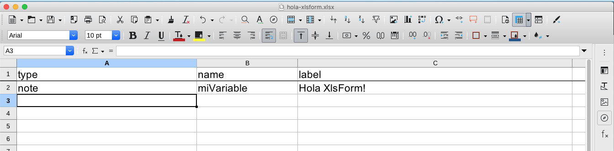
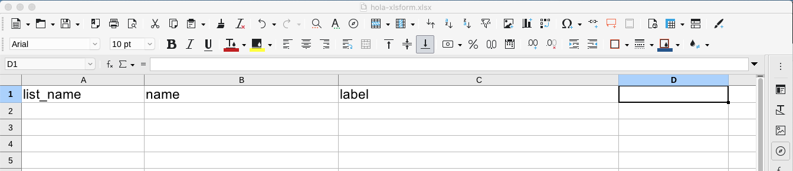
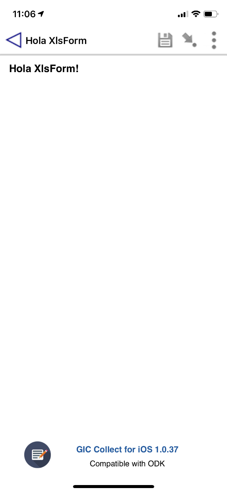

# Hola, XlsForm

Asi como el formato [XForms](holaXForms.md) abstraé mucha de la dificultad para la obtención, validación y transferencia de datos. XlsForm es una herramienta que simplifica la creación de estas formas.

Una Forma en formato XlsForm, es creada con Excel o cualquier herramienta que genere el formato .xls o preferible .xlsx. Herramientas que como Excel pueden generar este tipo de archivos son SpreadSheet de LibreOffice (Open Source), Numbers de iWorks (Apple), Sheets de G Suite (Google), entre otros.

Para generar la forma, debes crear un archivo Excel con 3 Hojas, nombrando a cada una de la siguiente forma, por convension los nombres de las hojas, columnas y controles mantenlas en minusculas, utilizando solo letras y números, y que el primer caracter del nombre sea letra.

1. hoja1 survey
2. hoja2 choices
3. hoja3 settings

## Hoja survey

En esta hoja vamos a poner el contenido principal que queremos mostrar, para eso utilizaremos una serie de Widgets/Controles con distintas funciones.

Pero por ahora, solo veremos un pequeño ejemplo.

En la hoja survey, en el primer renglon pon los siguientes valores como los nombres de las primeras 3 columnas:

- columna A: type
- columna B: name
- columna C: label

y en el siguiente renglón pon:

- columna A: note
- columna B: miVariable
- columna C: Hola XlsForm!

Esto debe quedar como la siguiente imagen:

## Hoja choices

Para este ejemplo, choices no la estaremos utilizando, solo pondremos los titulos de las columnas en el primer renglon, quedando de la siguiente forma:

- columna A: list_name
- columna B: name
- columna C: label

## Hoja settings

Para este ejemplo, solo vamos a utilizar los siguientes settings form_title y form_id, por lo que llenaremos los primeros 2 renglones con los siguientes valores, en el primer renglón:

- columna A: form_title
- columna B: form_id

y en el segundo renglón:

- columna A: Hola XlsForm
- columna B: hola-xlsform

## La forma hola-xlsform.xlsx en GIC Collect y ODK Collect

Despues de haber creado la forma en Excel, el siguiente paso es publicarla en un Servidor para estar formas.

Ya con la forma [hola-xlsform.xlsx](blankforms/hola-xlsform.xlsx) publicada en un Servidor, desde mi telefono o tableta, ya sea con GIC Collect para iOS o con ODK Collect para Android, me conecto al servidor y bajo la forma al dispositivo y ya puedo interactuar con dicho contenido, que en este caso me muestra la pantalla con la leyenda "Hola, XlsForm!", como en la siguiente imagen.

Los pasos intermedios mencionados en este artículo y el significado de los valores en las hojas, los estaremos viendo en siguientes artículos.

Como puedes observar, este artīculo lo hice el día de hoy en la mañana y ya puedo estar interactuando con mi contenido en el celular.

Impresionante, no?
